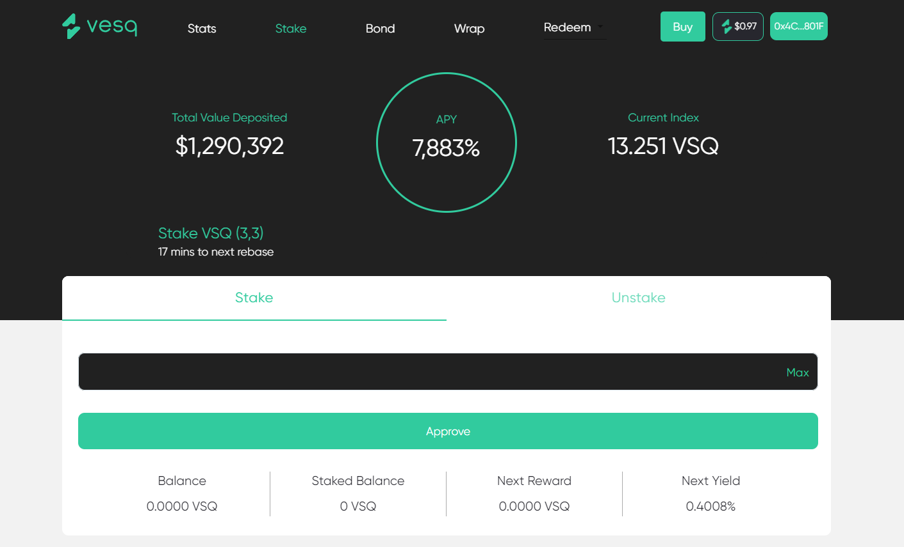

# [VESQ Dao on Polygon Main net Frontend](https://www.vesq.io/)

[Main Staking App](https://app.vesq.io)
This is the front-end repo for Vesq Finance that allows users be part of the future of vesq world.
This is forked from wonderland finance
[Wonderland Dao](https://www.wonderland.money/)
[Wonderland Staking App](https://app.wonderland.money/)
[wonderland git url](https://github.com/Wonderland-Money/wonderland-frontend)

## Main Design


This staking app is vesq-matic pool on Polygon main net
This is VSQ token contract address
[VSQ Token](https://polygonscan.com/address/0x29F1e986FCa02B7E54138c04C4F503DdDD250558)

### What is Vesq Finance?
[Vesq](https://www.vesq.io/) is the first decentralized cross-chain reserve currency protocol on the VSQ token. Each VSQ token is backed by a basket of assets (e.g., MIM, VSQ-MATIC LP Tokens etc etc) in the VESQ treasury, giving it an intrinsic value that it cannot fall below. VESQ also introduces economic and game-theoretic dynamics into the market through staking and minting. 

### What is Staking?
**Staking is the primary value accrual strategy of Vesq**. Stakers stake their TIME tokens on Vesq Website to earn rebase rewards. The rebase rewards come from the proceed from bond sales, and can vary based on the number of TIME staked in the protocol and the reward rate set by monetary policy.
Staking is a passive, long-term strategy. The increase in your stake of TIME translates into a constantly falling cost basis converging on zero. This means even if the market price of TIME drops below your initial purchase price, given a long enough staking period, the increase in your staked TIME balance should eventually outpace the fall in price.
When you stake, you lock TIME and receive an equal amount of MEMOries. Your MEMOries balance rebases up automatically at the end of every epoch. MEMOries is transferable and therefore composable with other DeFi protocols.
When you unstake, you burn MEMOries and receive an equal amount of TIME tokens. Unstaking means the user will forfeit the upcoming rebase reward. Note that the forfeited reward is only applicable to the unstaked amount; the remaining staked TIME (if any) will continue to receive rebase rewards.

## 🔧 Setting up Local Development

Required:

- [Node v14](https://nodejs.org/download/release/latest-v14.x/)
- [Yarn](https://classic.yarnpkg.com/en/docs/install/)
- [Git](https://git-scm.com/downloads)

```bash
git clone https://github.com/Abracadabra-money/wonderland-frontend.git
cd wonderland-frontend
yarn install
npm run start
```

The site is now running at `http://localhost:3000`!
Open the source code and start editing!

**Pull Requests**:
Each PR into master will get its own custom URL that is visible on the PR page. QA & validate changes on that URL before merging into the deploy branch.

## 👏🏽 Contributing Guidelines

_**NOTE**_: For big changes associated with feature releases/milestones, they will be merged onto the `develop` branch for more thorough QA before a final merge to `master`
